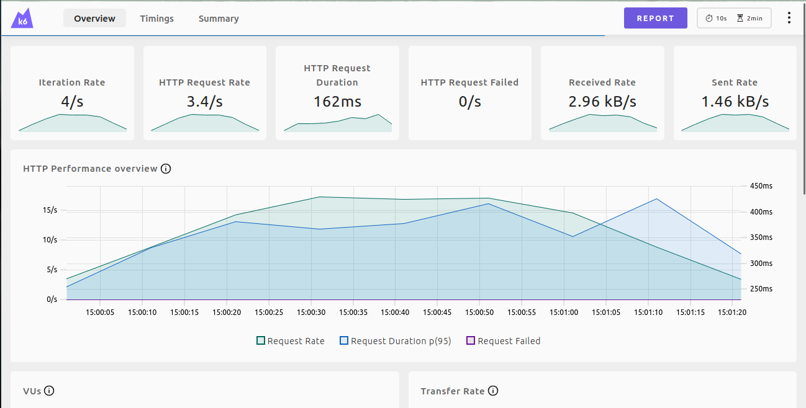
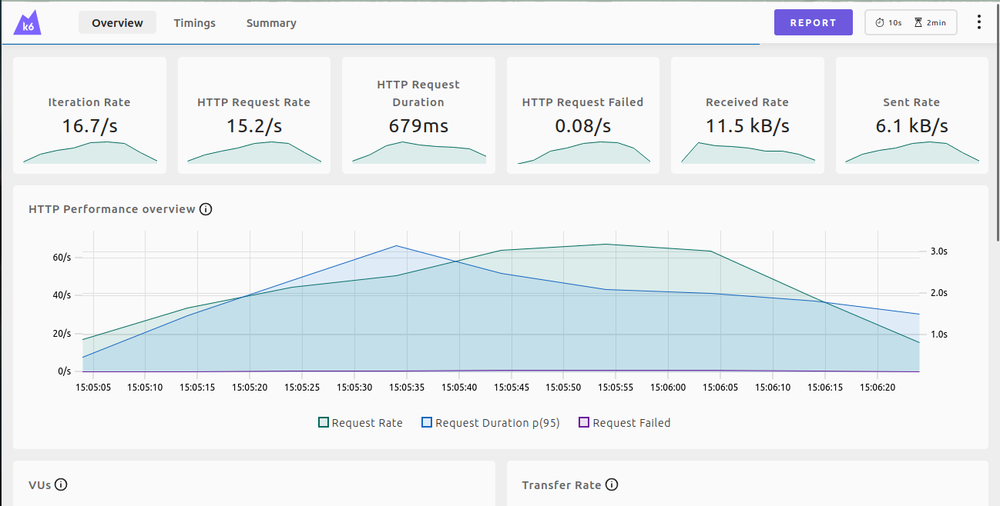

# **Load Testing com k6 - QuickPizza API**

Este projeto realiza testes de carga na API do QuickPizza usando a ferramenta **k6**. O objetivo é avaliar o desempenho da API, analisando métricas como tempo de resposta, número de requisições e falhas.

## **Configuração e Execução**

### **1. Clonar o Repositório**
```bash
git clone https://github.com/grafana/k6-oss-workshop.git
cd k6-oss-workshop
```

### **2. Iniciar a Aplicação com Docker**
```bash
docker compose up -d
```
Isso inicia três containers:
- **QuickPizza API** (aplicação-alvo)
- **Grafana** (visualização de métricas)
- **Prometheus** (coleta de métricas)

### **3. Instalar o k6**
#### **Linux (Ubuntu/Debian)**
```bash
sudo apt update
sudo apt install -y gpg
curl -fsSL https://dl.k6.io/key.gpg | sudo gpg --dearmor -o /usr/share/keyrings/k6-archive-keyring.gpg
echo "deb [signed-by=/usr/share/keyrings/k6-archive-keyring.gpg] https://dl.k6.io/deb stable main" | sudo tee /etc/apt/sources.list.d/k6.list
sudo apt update
sudo apt install -y k6
```
``

### **4. Executar o Teste**
```bash
k6 run test.js
```

## **A)**
O objetivo é avaliar o desempenho da API sob diferentes níveis de carga e analisar métricas de resposta, throughput e falhas.  

## **Resultados do Teste de Carga**  

### **⏳ Tempo das chamadas da API**
- **Média**: `140.65ms`
- **Mínimo**: `22.02ms`
- **Máximo**: `717.86ms`
- **Mediana**: `110.15ms`
- **Percentil 90**: `272.02ms`
- **Percentil 95**: `341.23ms`

### **📌 Número de requisições**
- **Total de requisições enviadas**: `277`
- **Taxa de requisições**: `13.44 req/s`

### **❌ Número de falhas**
- **Requisições com erro (status ≠ 200)**: `0`
- **Percentual de falha**: `0.00%`

### **📊 Outras métricas**
- **Iterações concluídas**: `277`
- **Usuários Virtuais (VUs)**: `Mín: 4 / Máx: 20`
- **Duração total da iteração**:  
  - **Média**: `1.14s`  
  - **Mínima**: `1.02s`  
  - **Máxima**: `1.71s`  
  - **P90**: `1.27s`  
  - **P95**: `1.34s`  

- **Dados transferidos**:  
  - **Recebidos**: `198 kB`  
  - **Enviados**: `101 kB`  

---

## **Conclusão**  
📌 O teste demonstrou que a API QuickPizza manteve um tempo de resposta médio de **140.65ms** mesmo sob carga moderada (até 20 usuários simultâneos).  
📌 Nenhuma requisição falhou, indicando que o sistema respondeu corretamente a todas as chamadas.  
📌 O tempo máximo registrado foi de **717.86ms**, o que pode indicar um possível gargalo em algumas requisições.  


## **B)**
Este projeto executa testes de carga na API QuickPizza, simulando um cenário de alto tráfego com 20 VUs e um 
tempo de rampa de 30 segundos.

## **2️⃣ Resultados do Teste de Carga**  

### **📌 Thresholds**  
✅ **95% das requisições foram respondidas abaixo de 500ms** (`p(95) = 358.47ms`)  
✅ **Taxa de erro abaixo de 1%** (`rate = 0.00%`)  

### **⏳ Tempo das chamadas da API**  
- **Média**: `157.81ms`  
- **Mínimo**: `23.27ms`  
- **Máximo**: `592.03ms`  
- **Mediana**: `130.81ms`  
- **Percentil 90**: `298.16ms`  
- **Percentil 95**: `358.47ms`  

### **📌 Número de requisições**  
- **Total de requisições enviadas**: `1057`  
- **Taxa de requisições**: `11.65 req/s`  

### **❌ Número de falhas**  
- **Requisições com erro (status ≠ 200)**: `0`  
- **Percentual de falha**: `0.00%`  

### **📊 Outras métricas**  
- **Iterações concluídas**: `1057`  
- **Usuários Virtuais (VUs)**: `Mín: 1 / Máx: 20`  
- **Duração total da iteração**:  
  - **Média**: `1.15s`  
  - **Mínima**: `1.02s`  
  - **Máxima**: `1.59s`  
  - **P90**: `1.29s`  
  - **P95**: `1.35s`  

- **Dados transferidos**:  
  - **Recebidos**: `765 kB`  
  - **Enviados**: `386 kB`  

---

## **3️⃣ Conclusão**  

✅ **O teste demonstrou que a API manteve um tempo médio de resposta de 157.81ms mesmo com 20 usuários simultâneos.**  
✅ **Nenhuma requisição falhou, indicando que o sistema respondeu corretamente a todas as chamadas.**  
✅ **Os thresholds foram respeitados, com 95% das requisições abaixo de 500ms.**  
⚠️ **O tempo máximo registrado foi de 592.03ms**, o que pode indicar um possível gargalo em picos de carga.  


## **C)**

### **📊 Resultados:**
1. **Thresholds atendidos**:  
   - **`checks`**: A taxa de sucesso dos checks foi de **100%** (a taxa exigida era superior a 90%).
   - **`http_req_duration` (p(95))**: O **p(95)** da duração das requisições foi de **418.7ms**, que está muito abaixo do limite de **1.1s** (1100ms), satisfazendo o critério.
   - **`http_req_failed`**: A taxa de falhas foi **0%**, bem abaixo da limitação de **1%**.

2. **Desempenho HTTP**:  
   - **Tempo médio das requisições (`http_req_duration`)**: **188.84ms**  
   - **Tempo máximo das requisições**: **751.86ms**  
   - **Tempo 95%** (`p(95)`): **418.7ms**

3. **Número de requisições**:  
   - Total de requisições: **1030**
   - Taxa de requisições: **11.43 requisições por segundo**

4. **Execução do teste**:  
   - **Duração média das iterações**: **1.19s**
   - **Número máximo de VUs**: **20**

5. **Dados de rede**:  
   - **Dados recebidos**: **746 kB**  
   - **Dados enviados**: **376 kB**

---

### **🚀 Conclusão**:
Os **SLOs de performance e confiabilidade** foram cumpridos, com as requisições respondendo dentro do 
limite de tempo estabelecido e sem falhas. O sistema está então a funcionar dentro das expectativas e escalando bem com os **20 VUs**.


## **D)**
Os resultados do teste mostram que a API está atendendo aos **Service Level Objectives (SLOs)** definidos, com todas as métricas atendendo aos requisitos estabelecidos. Aqui está um resumo das métricas e do que elas indicam:

### Resultados Gerais

- **Taxa de sucesso de verificações (`checks`)**:
  - A taxa de sucesso das verificações foi **100%**, indicando que todas as requisições retornaram status **200** e atenderam às verificações.
  - A verificação das condições adicionais (corpo da resposta e tamanho da resposta) também foi bem-sucedida.
  
- **Duração das requisições HTTP (`http_req_duration`)**:
  - O **percentil 95** (p95) da duração das requisições foi **349.21ms**, que é muito inferior ao limite definido de **1.1 segundos**.
  - O tempo médio de uma requisição foi **149.29ms**.

- **Taxa de falhas nas requisições (`http_req_failed`)**:
  - Não houve falhas nas requisições, com uma taxa de falhas de **0%**.

- **Número de requisições (`http_reqs`)**:
  - Foram feitas **1067 requisições**, com uma taxa média de **11.74 requisições por segundo**.

### Thresholds Configurados
Os **thresholds** estabelecidos foram todos atendidos:

1. **`checks: rate>0.98`** - A taxa de sucesso das verificações foi **100%**, o que atendeu ao limite de **98%** de sucesso.
   
2. **`http_req_duration{expected_response:true}: p(95)<1100`** - O **p95** foi **349.21ms**, bem abaixo do limite de **1100ms**.

3. **`http_req_failed: rate<0.01`** - Não houve falhas nas requisições, atingindo uma taxa de falha de **0%**.

### Análise Adicional
- A execução ocorreu durante **1 minuto e 30 segundos**, com a carga máxima de **20 VUs**.
- As verificações de sucesso e as métricas de desempenho, como o tempo de resposta, foram todas dentro dos limites aceitáveis, indicando que o sistema se comportou bem sob a carga de 20 VUs.

### Conclusão
O sistema passou com êxito nos **SLOs** definidos, com todas as métricas dentro dos requisitos estabelecidos. Isso sugere que a API é capaz de lidar com a carga de 20 VUs de maneira eficaz e dentro das expectativas de desempenho.


## **E)** 


## **F)** 
